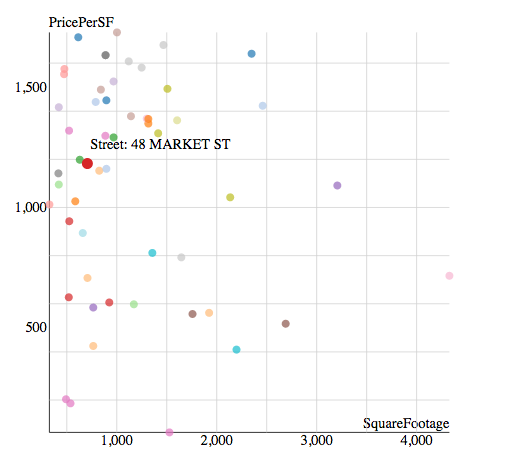

# d3_scatterplot
Image:
---

Links:
---
- This is my link:[http://erouirior.github.io/d3_scatterplot/scatterPlot.html](http://erouirior.github.io/d3_scatterplot/scatterPlot.html)
- You will see the circle color opacity and size changes when you mouseover each point, and at the same time the tooltip text occurs. 
